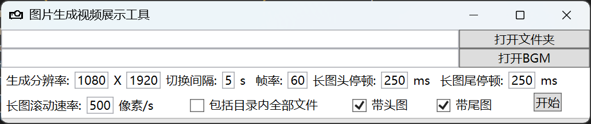
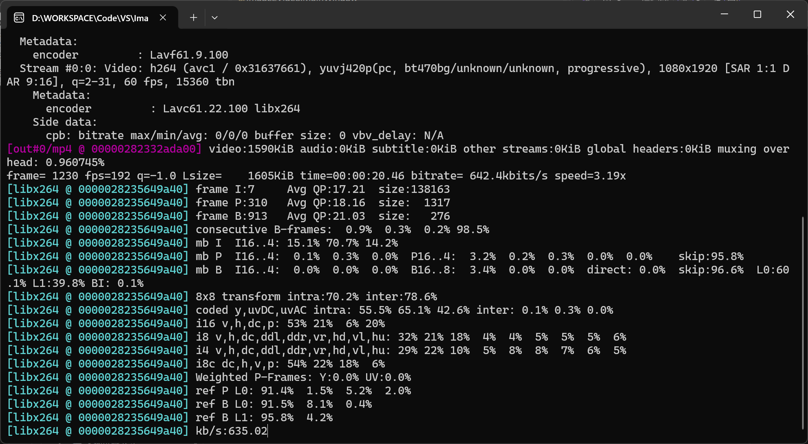

# 图片生成展示视频

## 功能介绍

能把选中文件夹内的图片转换成自己设定的分辨率视频并导出，短图采取等比缩放并填充黑边形式，长图采取滚动形式。
图片支持png、jpg格式图片。BGM支持MP3格式,不打开BGM则无BGM。
s
## 使用方法

1. 下载源码。
2. 生成二进制文件。
3. 在目录创建ffmpeg文件夹并放入ffmpeg.exe文件。
4. 头图请放入Res文件夹命名为start.png。
5. 尾图请放入Res文件夹命名为end.png。
6. 生成的视频会出现在Res文件夹内，并以打开的文件夹命名。

## 界面展示

## 展示视频见目录show.mp4
